<p align="center">
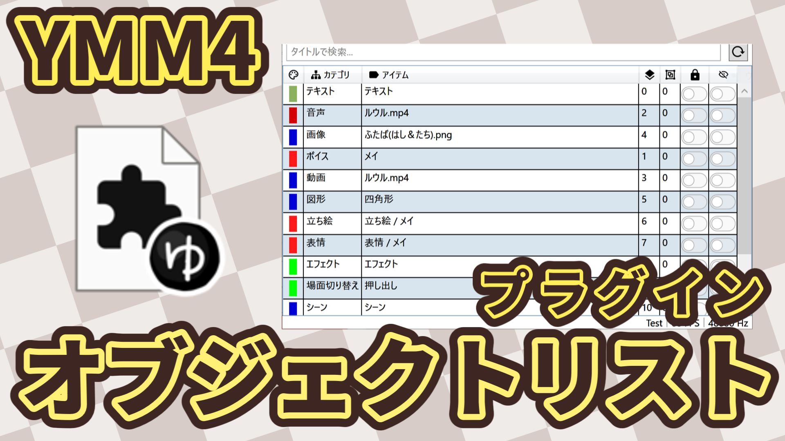
</p>

**2025年9月または10月予定の[YMM4本体のアプデ](https://x.com/manju_summoner/status/1954099689189503386)で動かなくなると思われます！**

# YMM4 オブジェクトリスト プラグイン

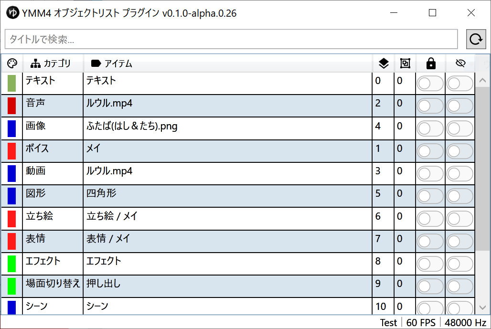

[](https://www.youtube.com/watch?v=aFCm6s7XBmM)


YMM4（ゆっくりムービーメーカー4）で作業中のタイムライン上のオブジェクトを一覧表示し、素早く選択・操作できるプラグインです。

- ⚠️ **このプラグインはYMM4の非公開APIを使用しているため、YMM4のアップデートで動作しなくなる可能性があります**
  -  **2025年9月または10月予定のYMM4本体のアプデで動かなくなると思われます！**
- その前提で使ってください！動かなくなったら連絡してね！

## 🎯 このプラグインでできること

- **アイテム一覧表示**：タイムライン上のすべてのアイテム（テキスト、画像、音声など）を見やすい一覧で表示
- **クイック選択**：一覧からクリックするだけで該当アイテムをタイムライン上で選択&アイテムエディタで表示
- **検索&ソート機能**：アイテム名での絞り込み検索、ソート機能
- **整理された表示**：レイヤー、グループ、ラベル情報で整理された見やすい表示

### アイテム一覧表示


タイムライン上のすべてのアイテム（テキスト、画像、音声など）を見やすい一覧で表示できます。

### クイック選択

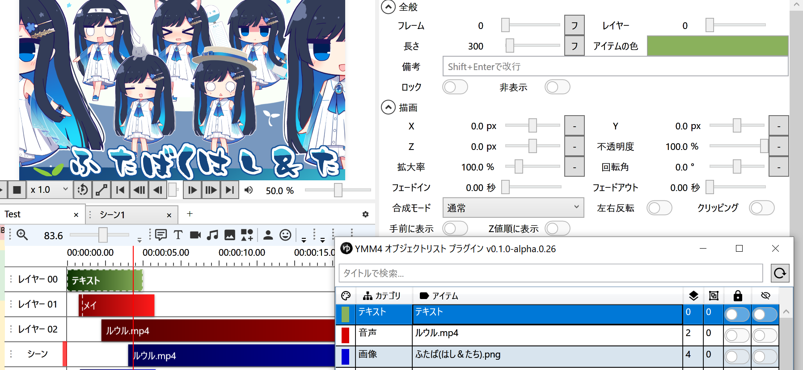

一覧からクリックするだけで該当アイテムをタイムライン上で選択します。
またサイドパネルのアイテムエディタで詳細が表示されます。

複数アイテム選択もできます。

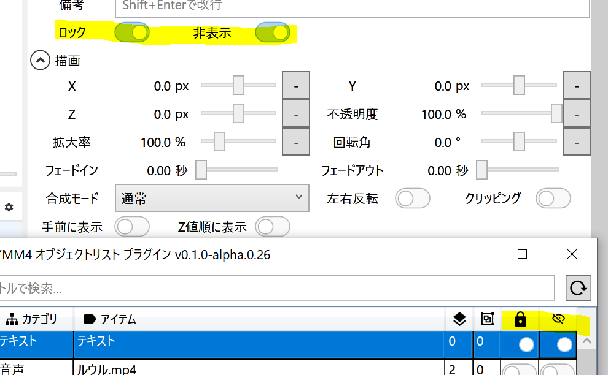

「ロック」と「非表示」ボタンはオブジェクトリストプラグインからも操作できます（連動します）。

### 検索&ソート機能

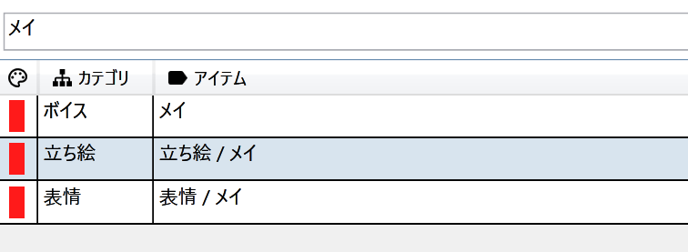

アイテム名での絞り込み検索ができます。
※アイテム名は備考のテキストも含まれます。

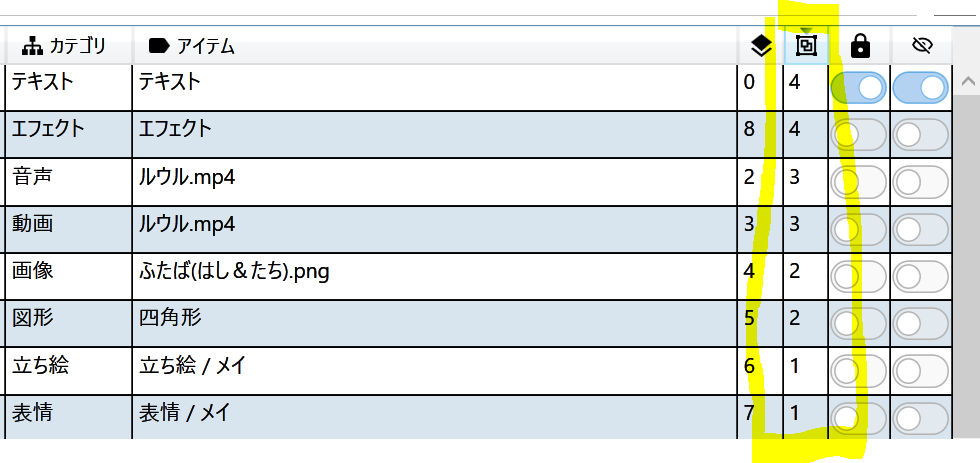

列のヘッダー部分をクリックするとアイテム表示をソートできます。
同じレイヤーのアイテム、とかを並べる時に便利です。

#### 追加フィルタ

> v1.1.x～

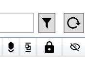
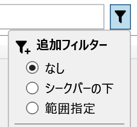

「追加フィルタ」で更に絞り込むことができます。

- シークバーの下
  - 現在のタイムラインのシークバーの下にあるアイテムを絞り込みます
  - プレビュー中も動くけどちょっと重いかも？
- 範囲指定
  - 指定した範囲内にあるアイテムを絞り込みます
  - 開始・終了の左のボタンをクリックすると、現在のフレームの値で指定できます

- 範囲フィルターオプション
  - 
  - 完全に範囲内：開始と終了の時間内に完全に入ってるアイテムだけを表示
  - 範囲と重複：範囲内に少しでも重なっているアイテムは表示

#### カテゴリフィルター機能

> v1.2.x～


- トグルをOFFにするとそのカテゴリが表示されなくなります。
- フィルターボタン（折りたたみ）とカテゴリ列のボタン、プラグインオプションの3か所から設定できます

### 整理された表示

レイヤー、グループ、ラベル情報で整理された見やすい表示ができます。

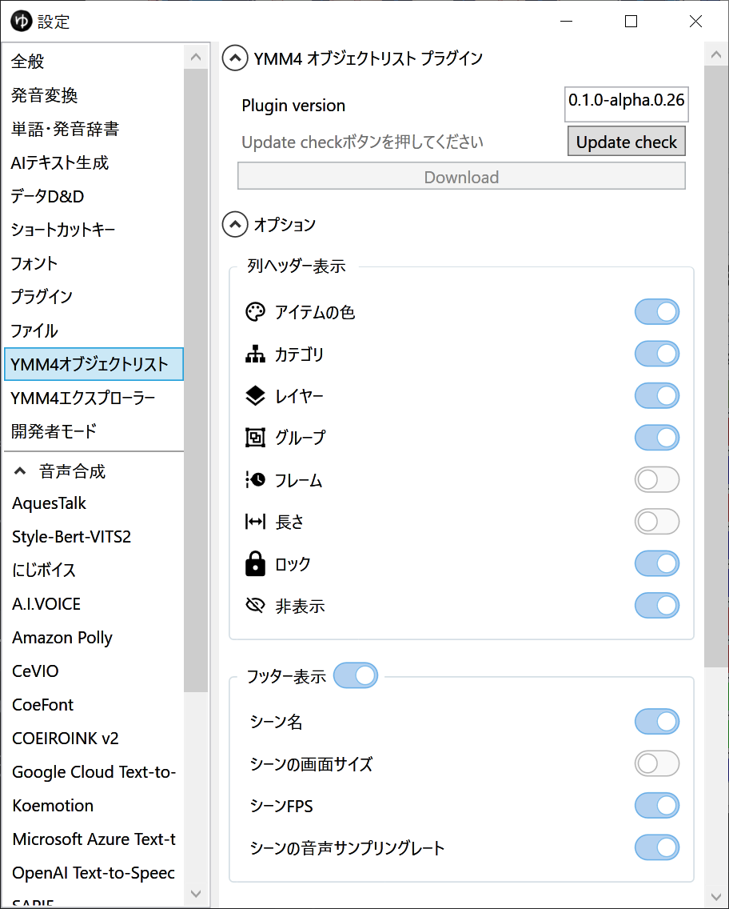

#### 列の表示ON/OFF

オプションで表示内容を変更できます。アイテム名だけのリストにする、とかもできます。

> 設定方法：YMM4のメニューの「設定」から「YMM4オブジェクトリスト」を選ぶ。

- 列
  - アイテムの色
  - アイテムカテゴリ
  - レイヤー
  - グループ
  - （開始）フレーム
  - 長さ
  - ロック
  - 非表示

- フッター自体のON/OFF
  - （表示している）シーン名
  - シーンの画面サイズ
  - シーンのFPS（フレームレート）
  - シーンの音声サンプリングレート

#### リストグループ表示

> v1.2.x～


リストを折りたたみできるグループでグループ表示できます。

カテゴリ・レイヤー・グループ・ロックON/OFF・非表示ON/OFFでグループ分けできます。

#### 長さ表示モードオプション

> v1.2.x～


アイテムの「長さ」の表示方法を切り替えます。

- 「フレーム」：フレーム数表示
- 「秒数」：秒数表示
- 「スマート」：1秒未満はフレーム数、1秒以上は秒数で表示します

「スマート」にするとこんな感じでフレーム数と秒数が混じります。


「長さ」列のヘッダーを右クリックでも変更できます。


## 📋 使い方

1. YMM4で動画編集プロジェクトを開く
2. メニューの「ツール」→「YMM4 オブジェクトリスト」を選択
  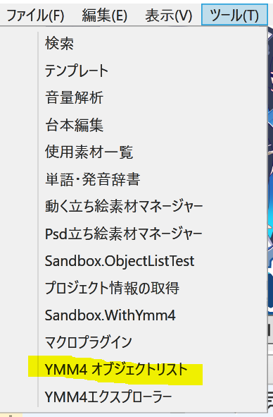
3. 別ウィンドウでオブジェクト一覧が表示されます
4. 一覧から選択したいアイテムをクリックすると、タイムライン上で自動選択されます

### 表示されないときの注意点

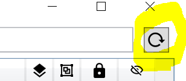

アイテム一覧が表示されないときは「再読み込み」ボタンを押してください。

- シーンを切り替えたとき
- プロジェクトを新しく読み込んだ時
- プラグインのウィンドウが起動時に開いたままだった時

## 💡 こんな時に便利

- **大量のアイテムがある動画**での目的のアイテム探し
- **複雑なレイヤー構造**の動画編集時の整理
- **特定の名前のオブジェクト**を素早く見つけたい時

## ⚠️ 注意事項

- **このプラグインはYMM4の非公開APIを使用しているため、YMM4のアップデートで動作しなくなる可能性があります**
- 問題が発生した場合は、YMM4本体の開発者ではなく、プラグイン作者（InuInu2022）にお問い合わせください

### 動作確認通知

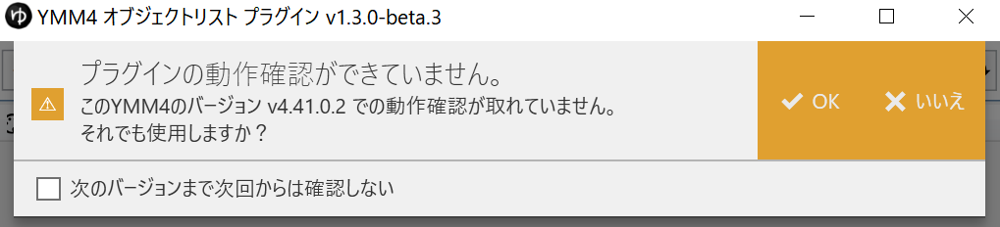

- v1.3.0以降、動作確認が取れていないYMM4のバージョンで動かす場合は確認ダイアログが出るようになりました
  - 「✔ OK」をクリックすると**無理やり動かします**
    - この場合動作保証できていないので動かなかったり、アプリが落ちちゃうことがあります
  - 怖い人は「✖️いいえ」を選んでください
- 「次のバージョンまで次回からは確認しない」にチェックをいれると動作確認しなくなります
  - 動作確認取れたときとかにチェック入れてください
  - スキップは最後にスキップしたときより新しい次のマイナーバージョン（v4.*）で解除されます

## 🛠️ インストール方法

1. [Releases](https://github.com/InuInu2022/YMM4ObjectListPlugin/releases)ページから最新版の`Ymm4ObjectListPlugin.v***.ymme`をダウンロード
2. ダウンロードしたymmeファイルをダブルクリックする または YMM4のプラグインフォルダに配置
3. YMM4を再起動

アップデートも同じ方法でアプデできます。

## 📊 システム要件

- ゆっくりムービーメーカー4 v4.41以上 ～ v4.45? or v4.46?
  - もう少し前のバージョンでも動く可能性はありますが確認していません
  - YMM4本体のドッキング対応バージョンで一度動かなくなると思います
    - 対応バージョンをその後に対応予定です
- .NET 9.0 Runtime
  - YMM4と同じです

## 🔗 関連リンク

- [作者のGitHub](https://github.com/InuInu2022)
- [YMM4公式サイト](https://manjubox.net/ymm4/)

## ライセンス

```txt
© InuInu 2025 - MIT License
```

- ライセンス詳細: [LICENSE](./LICENSE)
- 使用ライセンス一覧: [licenses/](./licenses/)

```txt
Material Design Icons
Icons / Apache 2.0
```

## ニコニ・コモンズ

ニコニコに投稿する際には以下のコンテンツIDを親子登録してください。

[nc424814](https://commons.nicovideo.jp/works/nc424814)

(YMM4の素材一覧からも確認できます。)

## その他

スクリーンショットの立ち絵イラストはゆめうつうつさんの「[ふたば(はし&たち)](https://seiga.nicovideo.jp/seiga/im11321172)」です。